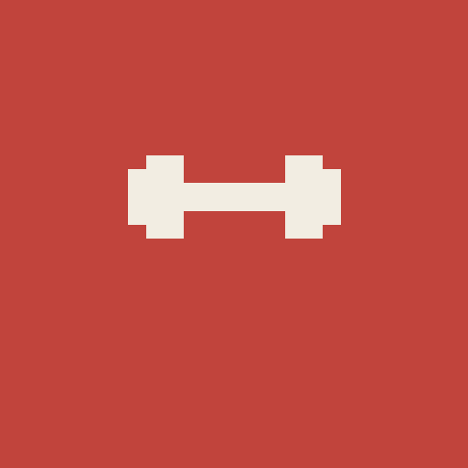
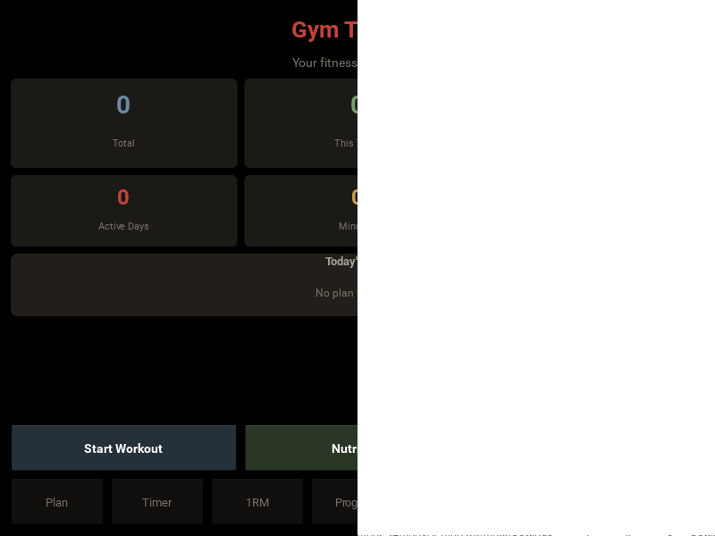

<p align="center">
  
</p>

<h1 align="center">Gym Tracker</h1>

<p align="center">
  <b>Offline-first gym tracking app with nutrition, recipes, and workout planning.</b><br>
  No ads. No subscriptions. No accounts. Your data stays on your phone.
</p>

<p align="center">
  
  
  
  
</p>

---

<p align="center">
  
</p>

---

## Features

### Workout Tracking
- Log exercises with sets, reps, and weight
- Rest timer, stopwatch, and Pomodoro timer for focused training
- Save workouts as templates for reuse
- Auto-detect personal records when you complete a set
- Estimated 1RM calculation and leaders ranking

### Exercise Library
- 80+ exercises with detailed descriptions and images
- Filter by category, equipment, or muscle group
- View exercise history and personal records per exercise

### Nutrition & Recipes
- Track daily calories, protein, carbs, and fat by meal
- Water intake tracking with custom goals
- **Recipe system** — create recipes with ingredients that auto-calculate macros from a 60+ food database
- Add custom ingredients with manual macro entry

### Weekly Plan
- Schedule exercises for each day of the week
- Start workouts directly from your plan

### Body Metrics
- Track weight, body fat, BMI, chest, waist, hips, bicep, and thigh
- See changes over time with comparison view
- Auto-calculated BMI and body fat zone classification

### Progress & Analytics
- Workout frequency charts (week/month/year)
- Muscle group distribution
- Body weight and duration trends
- Volume tracking
- Body measurement history table
- Achievement badges and workout streaks

### Calendar
- Monthly workout calendar view
- Color-coded days showing workout completions
- Tap any day for workout summary

### Settings
- Weight unit toggle (kg/lbs)
- Customizable default rest time and reps
- Database backup to device
- Full data reset option

## Download

**[Download the latest APK](https://github.com/Danielmrosu/Gym_Fit_Tracker/releases/latest)** from the Releases page.

### How to install

1. Download the `.apk` file from the latest release
2. Open the file on your Android phone
3. If prompted, enable **"Install from unknown sources"** in your settings
4. Install and open

> Requires Android 5.0 (API 21) or higher

## Running from Source

### Prerequisites

- Linux (tested on Ubuntu)
- Python 3.10+
- Java JDK 17

### Desktop (development)

```bash
# Clone the repository
git clone https://github.com/Danielmrosu/Gym_Fit_Tracker.git
cd Gym_Fit_Tracker

# Create and activate a virtual environment
python3 -m venv .venv
source .venv/bin/activate

# Install dependencies
pip install kivy

# Run the app
python main.py
```

### Android (Build APK)

```bash
# Install buildozer
pip install buildozer

# Build the debug APK
export VIRTUAL_ENV=$(pwd)/.venv
buildozer android debug
```

The APK will be generated in the `bin/` directory. First build downloads the Android SDK/NDK (~3GB) and takes 15-30 minutes. Subsequent builds are faster.

## Project Structure

```
gym_app/
├── main.py                 # App entry point and screen registration
├── gym.kv                  # All Kivy UI layout rules
├── database.py             # SQLite database operations
├── buildozer.spec          # Android build configuration
├── data/
│   ├── icon.png            # App icon
│   ├── presplash.png       # Android launch screen
│   └── exercises/          # Exercise images
└── screens/
    ├── home.py             # Home dashboard
    ├── workout.py          # Workout logging, templates, active workout
    ├── exercise_library.py # Exercise browser with filters
    ├── nutrition.py        # Nutrition tracking, recipes, water intake
    ├── progress.py         # Charts, PRs, achievements
    ├── body_metrics.py     # Body measurements tracking
    ├── timer.py            # Stopwatch, rest timer, Pomodoro
    ├── settings.py         # App settings
    ├── weekly_plan.py      # Weekly exercise scheduling
    └── calendar_view.py    # Workout history calendar
```

## Tech Stack

| Technology | Purpose |
|---|---|
| **Python 3** | Application logic |
| **Kivy** | Cross-platform UI framework |
| **SQLite** | Local database (no server needed) |
| **Buildozer** | Android APK packaging |

## Data Privacy

Your data **never leaves your phone**. There are no accounts, no cloud sync, no analytics, and no tracking. Everything is stored locally in an SQLite database on your device.

## Contributing

Contributions are welcome! If you find a bug or want to add a feature:

1. Fork the repository
2. Create a feature branch (`git checkout -b feature/my-feature`)
3. Commit your changes (`git commit -m 'feat: add my feature'`)
4. Push to the branch (`git push origin feature/my-feature`)
5. Open a Pull Request

## License

This project is licensed under the MIT License — see the [LICENSE](LICENSE) file for details.

---

<p align="center">
  Built with Python + Kivy
</p>
